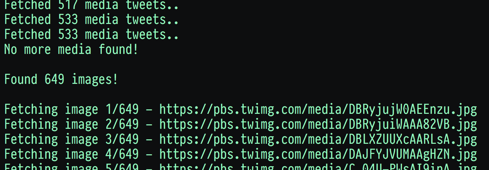

# mediascrape

Download a Twitter user's media easily, no API keys needed.

  

mediascrape requires no API credentials and instead relies on public endpoints combined with HTML parsing from [lxml](http://lxml.de/) to extract data.

## dependencies

* Python 3
  * Installation instructions and downloads for your OS can be found here: [https://www.python.org/downloads/](https://www.python.org/downloads/)

* Python module dependencies:
  * request
    * `pip3 install request`
  * lxml
    * `pip3 install lxml`
  * cssselect
    * `pip3 install cssselect`

## usage

to download all media images from a user 

`python3 mediascrape.py -u [user]`

eg: `python3 mediascrape.py -u lilbthebasedgod`

by default this will save all files to a directory of `/media/[user]/*`

If you wish to specify a directory to save media into you can do with with the `-o` or `--output` options like this:

`python3 mediascrape.py -u [user] -o [output directory]`

When using `-o` remember to specify an absolute path.

## multi\_mediascrape

to download all media images from a list of users, make a line-seperated `.txt` list of users and pass it to `multi_mediascrape` with `-f` 

`python3 multi_mediascrape.py -f [txt file of names]`

eg: `python3 multi_mediascrape.py -f /home/me/tweetscrape/models/names.txt`

by default this will save all files to a directory of `/media/[user]/*`

If you wish to specify a directory to save media into you can do with with the `-o` or `--output` options like this:

`python3 multi_mediascrape.py -f [txt file of names] -o [output directory]`

When using `-o` remember to specify an absolute path.

## memefinder

experimental script to find the same images posted in different tweets, possibly
suggesting the image is of meme interest

`python memefinder.py -d [optional directory] -x [show cross post only]`
